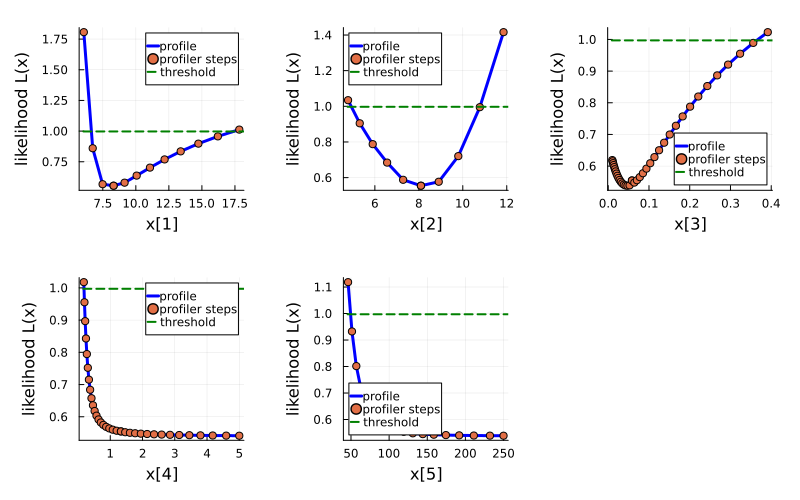

# Taxol model

As an example of practical identifiability analysis, we use the **Cancer Taxol Treatment Model**. It is an ODE model with 3 state variables and 5 parameters. The identifiability of this model was studied in [Marisa C.Eisenberg, Harsh V.Jain. A confidence building exercise in data and identifiability](https://www.sciencedirect.com/science/article/pii/S0022519317303454). We have translated [author's MATLAB code](https://github.com/marisae/cancer-chemo-identifiability) into Julia. The model is defined by the following system of differential equations:

```julia
using LikelihoodProfiler, Test
using Optimization, ForwardDiff, OrdinaryDiffEq

# https://github.com/marisae/cancer-chemo-identifiability/blob/master/Profile%20Likelihood/testa0_de.m
function ode_func(du, u, p, t, drug)
  let (a0, ka, r0, d0, kd) = (p[1], p[2], p[3], p[4], p[5])

      K   = 10.515*100
      V0  = 1.3907*K
      lam = 9.5722

      theta = 10.

      # Values taken from 
      aRP  = 20.     # per day from Kim_PrlifQuies

      Ncel = u[1] + u[2] + u[3]
      Lfac = ((K-Ncel)^theta)/((V0^theta) + ((K-Ncel)^theta))

      arstexp = 3.
      adthexp = 4.

      arst = a0*(drug^arstexp)/(ka^arstexp + (drug^arstexp))
      adth = d0*(drug^adthexp)/(kd^adthexp + (drug^adthexp))
      arcv = r0

      # The differntial equations
      du[1] = -lam*u[1] + aRP*u[2]*Lfac - arst*u[1] + arcv*u[3]
      du[2] = 2*lam*u[1] - aRP*u[2]*Lfac
      du[3] = arst*u[1] - adth*u[3] - arcv*u[3]
  end
end
```

Experimental datasets are also provided in the cancer-chemo-identifiability repo for four drug doses (5, 10, 40, 100)

```julia
# https://github.com/marisae/cancer-chemo-identifiability/blob/master/Profile%20Likelihood/testa0_fit.m

# Data from Terzis et al. Brit J Cancer 1997;75:1744.
# From Bowman et al. Glia 1999;27:22, glioma cell volume is 0.916
# picoliters, 1 mm^3 = 1e6 pl or ~1.091 million cells

times = [0., 3., 6., 9., 12., 15.]   # days

dose = [5., 10., 40., 100.];    # dose in ng/ml

# Control data
Cell = [0.009, 0.050, 0.120, 0.189, 0.230, 0.260]*1091.0   # thousands of cells
Cerr = [0.006, 0.012, 0.010, 0.011, 0.011, 0.011]*1091.0   # thousands of cells

# 0.005 ug/ml Taxol
Cell005 = [0.009, 0.047, 0.089, 0.149, 0.198, 0.219]*1091.0   # thousands of cells
Cerr005 = [0.006, 0.013, 0.010, 0.011, 0.013, 0.010]*1091.0   # thousands of cells

# 0.010 ug/ml Taxol
Cell010 = [0.009, 0.043, 0.077, 0.093, 0.109, 0.128]*1091.0   # thousands of cells
Cerr010 = [0.006, 0.012, 0.013, 0.012, 0.014, 0.012]*1091.0   # thousands of cells

# 0.040 ug/ml Taxol
Cell040 = [0.009, 0.025, 0.047, 0.054, 0.076, 0.085]*1091.0   # thousands of cells
Cerr040 = [0.005, 0.010, 0.010, 0.011, 0.010, 0.010]*1091.0   # thousands of cells

# 0.100 ug/ml Taxol
Cell100 = [0.009, 0.025, 0.026, 0.028, 0.029, 0.031]*1091.0   # thousands of cells
Cerr100 = [0.006, 0.010, 0.009, 0.008, 0.011, 0.011]*1091.0   # thousands of cells

C005 = LikelihoodProfiler.mean(Cell005)
C010 = LikelihoodProfiler.mean(Cell010)
C040 = LikelihoodProfiler.mean(Cell040)
C100 = LikelihoodProfiler.mean(Cell100)

data = [Cell005/C005, Cell010/C010, Cell040/C040, Cell100/C100]
datamean = [C005, C010, C040, C100]
```

Next we define solver options, initial values, optimal parameter values, and tspan

```julia
# solver algorithm and tolerances
solver_opts = Dict(
    :alg => AutoTsit5(Rosenbrock23()),
    :reltol => 1e-6,
    :abstol => 1e-8
)

# initial values and parameters
# https://github.com/marisae/cancer-chemo-identifiability/blob/master/Profile%20Likelihood/testa0_soln.m#L3-L6
# https://github.com/marisae/cancer-chemo-identifiability/blob/master/Profile%20Likelihood/testa0_fit.m#L4

u0 = [7.2700, 2.5490, 0.]
p0 = [8.3170, 8.0959, 0.0582, 1.3307, 119.1363] 

tspan = (0.,15.)
```
 
 We use OLS for the objective function as proposed in the original code.

 ```julia
# https://github.com/marisae/cancer-chemo-identifiability/blob/master/Profile%20Likelihood/testa0_fit.m#L92
# https://www.mathworks.com/help/optim/ug/lsqcurvefit.html
function taxol_obj(
  x, _p;
  ode_func=ode_func,
  dose=dose,
  data=data,
  datamean=datamean,
  times=times,
  solver_opts=solver_opts
)
  loss = 0.
  for (i,d) in enumerate(dose)
     prob = ODEProblem((du,u,p,t)->ode_func(du,u,p,t,d), u0, tspan, x)
     sol = solve(prob, 
                 solver_opts[:alg], 
                 reltol=solver_opts[:reltol],
                 abstol=solver_opts[:abstol],
                 saveat=times)
      
     sim = (sol[1,:] + sol[2,:] + sol[3,:])/datamean[i]
     loss += sum((sim-data[i]).^2)
  end
  return loss
end

# threshold is chosen according to
# https://github.com/marisae/cancer-chemo-identifiability/blob/master/Profile%20Likelihood/testa0_fit.m#L40-L41
sigmasq = (LikelihoodProfiler.mean([(Cerr005/C005); (Cerr010/C010); (Cerr040/C040); (Cerr100/C100)]))^2
```

Next, we construct the profile likelihood problem `ProfileLikelihoodProblem` and run the profiler for the five parameters:

```julia
lb = [2.0, 2.0, 0.01, 0.05, 30.]
ub = [30.0, 30.0, 0.6, 5.0, 250.0]

optf = OptimizationFunction(taxol_obj, Optimization.AutoForwardDiff())
optprob = OptimizationProblem(optf, p0; lb=lb, ub=ub)

plprob = ProfileLikelihoodProblem(optprob, p0; threshold = sigmasq*chi2_quantile(0.95, 5))

profile_step(p0, i) = p0[i] * 0.1
method = OptimizationProfiler(optimizer = Optimization.LBFGS(), stepper = FixedStep(; initial_step=profile_step))
sol = solve(plprob, method)
plot(sol, size=(800,300), margins=5Plots.mm)
```

Finally, we plot the resulting profiles:


