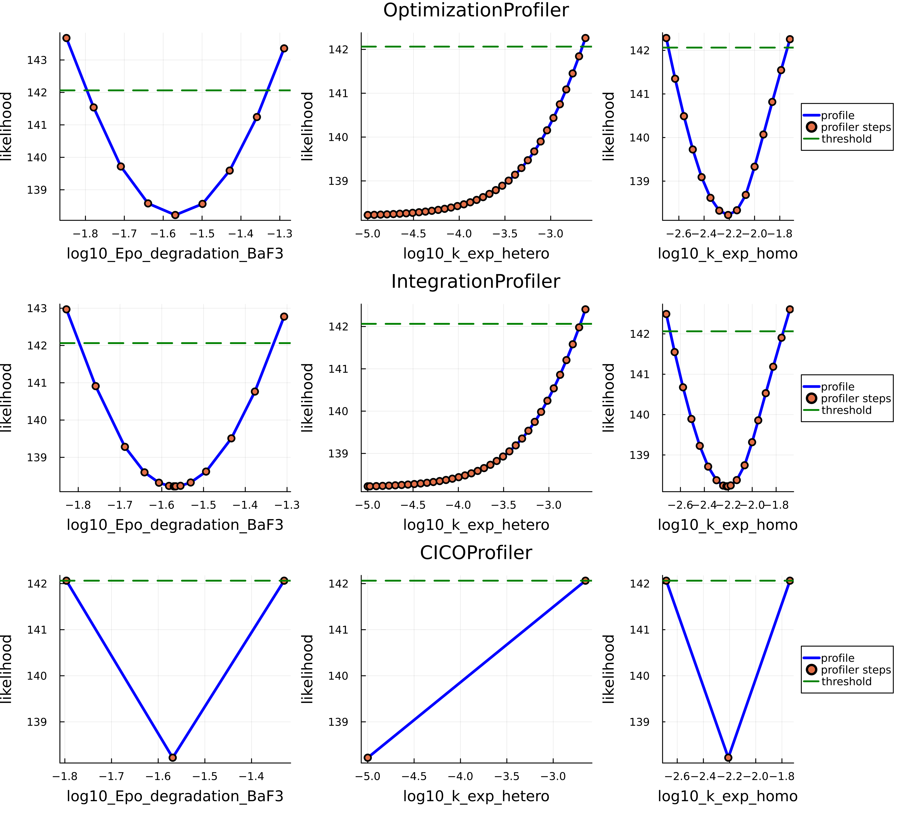

## Summary

Practical identifiability addresses the critical question of how well a mechanistic model is determined by the available experimental data. In a typical model's calibration workflow practical identifiability implies prior structural identifiability, which studies and resolves the uncertainty within the model structure independently from the available data. However, in many cases, profile likelihood-based methods are also used as a proxy for structural identifiability analysis, particularly when the complexity of a model makes structural methods inapplicable or computationally prohibitive [@Wieland2021]. Moreover, profile likelihood techniques can be extended beyond parameter analysis to assess the identifiability of model states and predictions. This versatility makes profile likelihood analysis an essential component in the development and validation of models in Systems Biology (SB) and Quantitative Systems Pharmacology (QSP).

LikelihoodProfiler.jl is an open-source Julia package designed to perform profile likelihood-based identifiability analyses by offering a unified and extensible interface.

## Statement of Need

Despite the widespread use of profile likelihood methods in practical identifiability analysis, existing tools often lack a common interface and extensive ecosystem integration, limiting accessibility and reproducibility. Also different profile likelihood based methods are implemented in different software tools, which requires the user to switch between different languages and software interfaces. LikelihoodProfiler.jl addresses these limitations by providing:
- Unified interface to access multiple profiling methods.
- Compatibility with common modeling standards (Heta [@Metelkin2021], PEtab [@Persson2025], SBML).
- Integration with Julia’s SciML [@Rackauckas2017] for efficient computation and extensibility.

## Features and Methodologies

LikelihoodProfiler.jl supports the following methods for profiling likelihood functions and estimating confidence intervals:
1. **OptimizationProfiler** follows the classical approach, employing stepwise re-optimization of the likelihood function under parameter constraints. It is intuitive but may be computationally intensive.
2. **IntegrationProfiler** computes likelihood profiles by solving differential equations derived from optimization problems, yielding smooth profiles. This method is advantageous but demands accurate Hessian computations or approximations, posing challenges for large models.
3. **CICOProfiler** estimates confidence interval endpoints directly via constrained optimization, avoiding full-profile reconstruction, thus providing efficient confidence interval estimation for practical scenarios [@Borisov2020].

All methods leverage a CommonSolve interface [@Rackauckas2017] (`CommonSolve.solve()`), supporting global settings for parallelization and verbosity. Profiling results are directly visualizable using the Plots.jl package and exportable as DataFrames for further analysis.

## Demonstrative Example: JAK/STAT Signaling Pathway Model

LikelihoodProfiler.jl’s functionality and interfaces are demonstrated using the JAK/STAT signaling pathway model [@Boehm2014], which consists of 8 states and 9 parameters. The model and experimental data were sourced from the Benchmark-Models-PEtab repository and imported through the PEtab.jl interface.

```julia
using PEtab, Plots
petab_model = PEtabModel("Boehm_JProteomeRes2014.yaml")
petab_problem = PEtabODEProblem(petab_model)
```

To define the profile likelihood problem, we construct an OptimizationProblem instance and provide the optimal parameter values:

```julia
using Optimization, LikelihoodProfiler
optprob = OptimizationProblem(petab_problem)
plprob = PLProblem(optprob, get_x(petab_problem))
```

LikelihoodProfiler.jl offers a suite of methods for profiling likelihood functions and assessing practical identifiability. Each method includes several configurable options, such as optimizer or integrator selection, tolerances, and step size. The most straightforward method is OptimizationProfiler, which follows the classical approach of stepwise re-optimization of the likelihood function under a constraint on the parameter of interest.

```julia
alg1 = OptimizationProfiler(optimizer = Optimization.LBFGS(), stepper = FixedStep(; initial_step=0.07))
```

A more advanced method is the IntegrationProfiler, which computes likelihood profiles by solving a system of differential equations derived from the underlying optimization problem. This method requires a differential equation solver (integrator) to be specified.

```julia
using OrdinaryDiffEq
alg2 = IntegrationProfiler(integrator = Tsit5(), integrator_opts = (dtmax=0.07,), matrix_type = :hessian)
```

An alternative approach, implemented in CICOProfiler, estimates the confidence intervals (CI) endpoints directly—without reconstructing the full profile—by solving a constrained optimization problem [@Borisov2020]. This method is often more efficient when only the CI is required.

```julia
alg3 = CICOProfiler(optimizer = :LN_NELDERMEAD, scan_tol = 1e-10)
```

All profiling methods share a common `solve()` interface.

```julia
sol = solve(plprob, alg1)
```

All three profiling approaches yielded comparable confidence intervals, emphasizing the reliability and flexibility of LikelihoodProfiler.jl for different modeling scenarios.

Below are the profile likelihoods for the first three parameters of the JAK/STAT model, computed using the three methods:

{ width=60% }

All three methods reported similar CI for the JAK/STAT model, which can be accessed using the `get_endpoint()` function.

| **Parameter**     | **OptimizationProfiler** | **IntegrationProfiler** | **CICOProfiler** |
|------------------------------:|----------------------------------------------:|---------------------------------------------:|--------------------------------------:|
| log10\_Epo\_degradation\_BaF3 | (-1.79612, -1.33173)                          | (-1.79748, -1.33172)                         | (-1.79661, -1.3302)                   |
| log10\_k\_exp\_hetero         | (nothing, -2.65263)                           | (nothing, -2.65244)                          | (nothing, -2.8089)                    |
| log10\_k\_exp\_homo           | (-2.68323, -1.73872)                          | (-2.68661, -1.73886)                         | (-2.68367, -1.73888)                  |
| log10\_k\_imp\_hetero         | (-1.94661, -1.62555)                          | (-1.94707, -1.6217)                          | (-1.94888, -1.62229)                  |
| log10\_k\_imp\_homo           | (-0.109411, nothing)                          | (-0.109301, nothing)                         | (-0.109678, nothing)                  |
| log10\_k\_phos                | (4.08355, 4.33082)                            | (4.08025, 4.33155)                           | (4.07836, 4.33194)                    |
| log10\_sd\_pSTAT5A\_rel       | (0.364585, 0.870501)                          | (0.364487, 0.869323)                         | (0.362142, 0.870803)                  |
| log10\_sd\_pSTAT5B\_rel       | (0.625924, 1.08439)                           | (0.624763, 1.08514)                          | (0.62272, 1.0853)                     |
| log10\_sd\_rSTAT5A\_rel       | (0.312047, 0.762828)                          | (0.312496, 0.763286)                         | (0.307907, 0.763785)                  |

\* `nothing` here means that the parameter is not restricted within the parameter range, i.e. it does not meet the threshold for being considered identifiable.

The optimal profiling method and settings depend on the complexity of the model and the goal of the analysis:
- OptimizationProfiler benefits from the choice of optimization algorithm (e.g., gradient-based or derivative-free) but may be computationally intensive.
- IntegrationProfiler provides smooth profile trajectories but requires Hessian computation or approximation, which may be challenging for large-scale models.
- CICOProfiler is often more efficient for fast CI estimation when the full profile is not needed.

## Implementation and Extensibility

All profiling methods benefit from the unified interface provided by LikelihoodProfiler.jl:
- Integration with SciML packages gives users access to a wide range of optimizers, differential equation solvers, and AD backends, enabling efficient profiling configurations.
- Compatibility with Heta, PEtab and SBML formats broadens the accessibility of the package across different modeling frameworks.
- `solve()` interface provided by `CommonSolve.jl` provides unified access various profiling methods 
- A common parallelization setup, controlled via the `parallel_type` argument in the `solve()` function, is supported across all methods and can significantly accelerate computations.
- The interface facilitates integration of new profiling methods and stepping algorithms.

Future work will include adding new methods of parameters, functions and predictions profiling and enabling adaptive switching between strategies.

## Availability

LikelihoodProfiler.jl is open-source and available at: https://github.com/insysbio/LikelihoodProfiler.jl

The package is registered in Julia and can be installed from the Julia REPL using:
```julia
import Pkg; Pkg.add("LikelihoodProfiler")
```

Tutorials and documentation are available at: https://insysbio.github.io/LikelihoodProfiler.jl/stable/

Benchmarks and profile methods comparison are available as Jupyter notebooks in the `/benchmark` directory of the `LikelihoodProfiler.jl` repository.

## Related packages

In the Julia ecosystem, `ProfileLikelihood.jl` provides fixed-step, optimization-based profiles and also supports 
bivariate profile likelihoods. 

`InformationGeometry.jl` approaches the problem from a differential-geometric perspective, exposing tools to analyze 
likelihood surfaces (including profiles support). 
While these packages target overlapping use cases, their APIs and underlying methods are specialized 
and not designed around a single, unified profile likelihood interface.

Outside Julia, widely used workflows include `Data2Dynamics (MATLAB)`, `dMod (R)`, `pyPESTO (Python)` which combine parameter estimation, sensitivity analysis, and profile likelihoods within end-to-end modeling environments. 
Additional domain-specific toolboxes (e.g. MATLAB SimBiology) provide tools to estimate likelihood profiles. 

Collectively, different methods (stepwise re-optimization, integration-based approaches, direct interval estimation) are often confined to different packages and languages, with heterogeneous APIs and varying levels of compatibility with community formats.

LikelihoodProfiler.jl is designed to complement this landscape by bringing multiple profiling strategies under a single, 
Julia-native interface. 
It unifies optimization-based, integration-based, and direct confidence-interval estimation methods behind 
a common solve API, integrates with the SciML stack for efficient solvers and automatic differentiation. 
This combination aims to reduce context-switching between tools and to make method selection 
a matter of configuration rather than of changing software stacks.

## References
