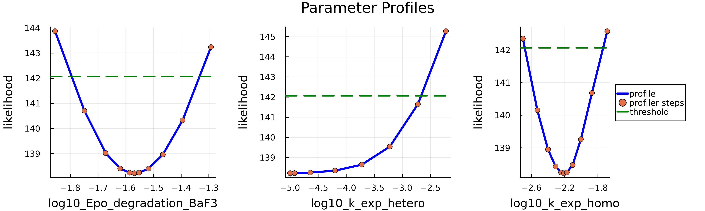
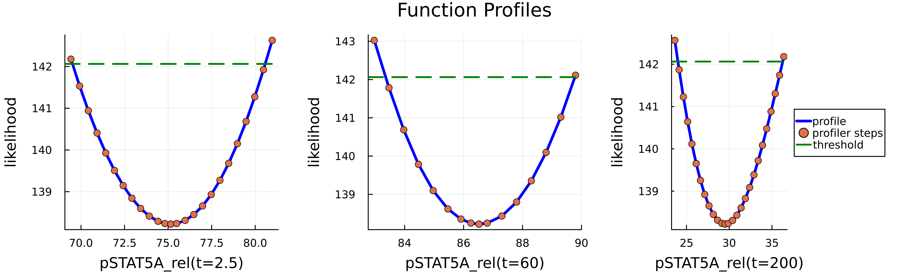

## Summary

Practical identifiability addresses how well a mechanistic model is determined by available experimental data. Profile likelihood-based methods are widely used to explore practical identifiability and serve as a proxy for structural identifiability analysis [@Heinrich2025]. Moreover, these methods can be extended beyond parameter analysis to assess the identifiability of model states and predictions. This versatility makes profile likelihood an essential component in the development and validation of models.

The paper presents `LikelihoodProfiler.jl`, an open-source Julia package for conducting profile likelihood-based identifiability and predictability analysis.

## Statement of Need

Despite the widespread use of profile likelihood methods for practical identifiability analysis, existing tools are typically bound to specific modeling frameworks or software environments. Moreover, different profile likelihood algorithms are implemented in separate tools, which requires the user to switch between languages and software interfaces. `LikelihoodProfiler.jl` addresses these limitations by providing:
- Unified interface to access multiple profile likelihood algorithms.
- Compatibility with common modeling standards (SBML, PEtab [@Persson2025], Heta [@Metelkin2021]).
- Integration with Julia’s SciML [@Rackauckas2017] for efficient computation and extensibility.

## Features and Methodologies

`LikelihoodProfiler.jl` provides a unified interface for various profile likelihood methods, including optimization-based **OptimizationProfiler** and integration-based profiles **IntegrationProfiler**, CI endpoints search **CICOProfiler** [@Borisov2020], and more.

All methods leverage a CommonSolve interface [@Rackauckas2017] (`CommonSolve.solve()`), supporting global settings for parallelization and verbosity. Profiling results are directly visualizable using the `Plots.jl` package and exportable as DataFrames for further analysis.

## Demonstrative Example: JAK/STAT Signaling Pathway Model

`LikelihoodProfiler.jl`’s functionality and interfaces are demonstrated using the JAK/STAT signaling pathway model [@Boehm2014], which consists of 8 states and 9 parameters. The model and experimental data were sourced from the Benchmark-Models-PEtab repository [@petab_benchmark_collection] and imported through the `PEtab.jl` package [@Persson2025].

```julia
using Petab, LikelihoodProfiler, Plots
petab_model = PEtabModel("Boehm_JProteomeRes2014.yaml")
petab_problem = PEtabODEProblem(petab_model)
```

To study the identifiability of the JAK/STAT model parameters, we first construct a `ProfileLikelihoodProblem` and select an appropriate profiling method.
A `ProfileLikelihoodProblem` is defined by providing (i) the objective function (typically the negative log-likelihood) and (ii) the initial parameter values corresponding to the optimum of this objective. `LikelihoodProfiler.jl` builds on the `Optimization.jl` interface [@vaibhav_kumar_dixit_2023_7738525], and  `ProfileLikelihoodProblem` wraps an `OptimizationProblem` defined in `Optimization.jl`.
In addition, `ProfileLikelihoodProblem` allows users to specify optional arguments common across profiling methods, such as the indices of parameters to profile, the likelihood-ratio threshold, and other options.
```julia
using Optimization, OrdinaryDiffEq
optprob = OptimizationProblem(petab_problem)
param_profile_prob = ProfileLikelihoodProblem(optprob, get_x(petab_problem); idxs=1:3)
```
We can then apply one of the available profiling methods to solve the `ProfileLikelihoodProblem`. In this example, we use the Hessian-free variant of the IntegrationProfiler [@Chen2002], which approximates the likelihood profile and performs re-optimization after each ODE solver step to prevent divergence from the true profile trajectory. Each profiling method offers several configurable options.
```julia
alg = IntegrationProfiler(integrator = Tsit5(), integrator_opts = (dtmax=0.5, reltol=1e-3, abstol=1e-4),
  matrix_type = :identity, gamma=0., reoptimize=true, 
  optimizer = Optimization.LBFGS(),optimizer_opts=(maxiters=10000,))

sol_param = solve(param_profile_prob, alg, verbose=true)
```

Users can get estimated confidence intervals using the `endpoints(sol_param)` function or visualize profile curves with `plot()`.



The same algorithm can also be applied to arbitrary functions of parameters. This generalization of profile likelihood concept [@Kreutz2012] can be used to study model reparametrization or predictability analysis. This functionality is available within the same interface: users define functions of parameters and provide them as the third argument to the problem. As an illustration, we define a function that returns the observable value at selected time points:

```julia
function pSTAT5A_rel_obs(x, p, t)
  sol = get_odesol(x, petab_problem)(t)
  specC17 = 0.107
  return (100 * sol[7] + 200 * sol[6] * specC17) / (sol[7] + sol[1] * specC17 + 2 * sol[6] * specC17)
end
pSTAT5A_rel_optf(t) = OptimizationFunction((x, p) -> pSTAT5A_rel_obs(x, p, t), AutoFiniteDiff())

times = [2.5, 60.0, 200.0]
func_profile_prob = ProfileLikelihoodProblem(optprob, init_pars, [pSTAT5A_rel_optf(t) for t in times];
  profile_lower=0.0, profile_upper=120.0)

sol_func = solve(func_profile_prob, alg)
```


Prediction confidence interval endpoints can be estimated at a larger set of time points, and smooth prediction bands can then be plotted.


## Implementation and Extensibility

All profiling methods benefit from the unified interface provided by `LikelihoodProfiler.jl`:
- Integration with `SciML` packages gives users access to a wide range of optimizers, differential equation solvers, and AD backends, enabling efficient profiling configurations.
- Compatibility with `Heta`, `PEtab` and `SBML` formats broadens the accessibility of the package across different modeling frameworks.
- `solve()` interface provided by `CommonSolve.jl` provides unified access various profiling methods which can be used both for parameters and for functions identifiability analysis
- A common parallelization setup, controlled via the `parallel_type` argument in the `solve()` function, is supported across all methods and can significantly accelerate computations.
- The interface facilitates integration of new profiling methods and stepping algorithms.

Future work will include adding new methods of parameters, functions and predictions profiling and enabling adaptive switching between strategies.

## Availability

LikelihoodProfiler.jl is open-source and available at: https://github.com/insysbio/LikelihoodProfiler.jl

The package is registered in Julia and can be installed from the Julia REPL using:
```julia
import Pkg; Pkg.add("LikelihoodProfiler")
```

Tutorials and documentation are available at: https://insysbio.github.io/LikelihoodProfiler.jl/stable/

## Related packages

Julia packages, such as `ProfileLikelihood.jl` and `InformationGeometry.jl`, offer related functionality but do not provide multiple profiling methods through a unified interface. Outside Julia, tools like `Data2Dynamics (MATLAB)`, `dMod (R)`, and `pyPESTO (Python)` combine parameter estimation and profile likelihoods. However, these frameworks are typically tied to their respective modeling environments and are not designed to support identifiability analysis independently of the model-development workflow. `LikelihoodProfiler.jl` addresses these limitations by providing a Julia-native API that integrates several profiling strategies under one interface, reducing context-switching and making method selection a matter of configuration.

## References
