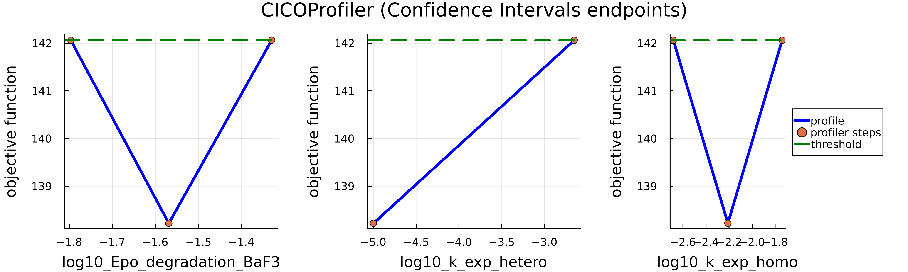

## Summary

Mathematical models — mechanistic, statistical, or otherwise — contain unknown parameters that must be estimated from data to enable reliable predictions. Profile likelihood is a widely used approach for studying the *practical identifiability* of such models, that is, assessing whether the available data constrain parameter estimates tightly enough to yield finite confidence intervals. Moreover, profile likelihood techniques can be generalized to analyze derived quantities such as model states and predictions. This versatility makes profile likelihood an essential component in model development and uncertainty assessment [@Heinrich2025].

`LikelihoodProfiler.jl` is an open-source Julia package that implements several profile likelihood methods through a unified interface, enabling parameters and prediction uncertainty analysis across general maximum-likelihood estimation problems.

## Statement of Need

Researchers across many scientific domains need tools to quantify how well model parameters and predictions are constrained by data. Profile likelihood methods provide an intuitive and interpretable approach to parameter and prediction uncertainty, but existing software implementations - such as `sbioparameterci (MATLAB)`, `dMod (R)`, and `pyPESTO (Python)` - are often tied to specific modeling ecosystems or limited to a single profiling method. Users working with statistical models, mechanistic models, or simulation-based models may therefore need to combine multiple tools or reimplement profiling routines for each workflow.

`LikelihoodProfiler.jl` addresses this need by providing a unified, model-agnostic interface for computing profile likelihoods for parameters and arbitrary functions of parameters. The package offers several profiling methods - such as optimization-based `OptimizationProfiler`, integration-based `IntegrationProfiler`, confidence-interval endpoint search via `CICOProfiler` - and integrates with the Julia SciML [@Rackauckas2017], making profile likelihood analysis accessible and efficient for a wide variety of applied problems.

## Demonstrative Example: JAK/STAT Signaling Pathway Model

`LikelihoodProfiler.jl`’s functionality is demonstrated using the example from Systems Biology: JAK/STAT signaling pathway ODE model [@Boehm2014], which consists of 8 states and 9 parameters. The model and experimental data were sourced from the Benchmark-Models-PEtab repository [@petab_benchmark_collection] and imported through the `PEtab.jl` package [@Persson2025].

```julia
using LikelihoodProfiler, OptimizationLBFGSB, 
      OrdinaryDiffEqTsit5, PEtab, CICOBase, Plots

petab_model = PEtabModel("Boehm_JProteomeRes2014.yaml")
petab_problem = PEtabODEProblem(petab_model)
```

To study the identifiability of the JAK/STAT model parameters, we first construct a `ProfileLikelihoodProblem`.
`ProfileLikelihoodProblem` is defined by providing (i) the objective function (typically the negative log-likelihood) and (ii) parameter values corresponding to the optimum of this objective. `LikelihoodProfiler.jl` builds on the `Optimization.jl` interface [@Dixit2023], and  `ProfileLikelihoodProblem` wraps an `OptimizationProblem`. In addition, `ProfileLikelihoodProblem` allows users to specify optional arguments, such as the indices of parameters to profile, upper and lower bounds, and other options.

```julia
optprob = OptimizationProblem(petab_problem)
optpars = Vector(get_x(petab_problem))
param_profile_prob = ProfileLikelihoodProblem(optprob, optpars; idxs=1:3)
```
`LikelihoodProfiler.jl` offers a suite of methods to solve the `ProfileLikelihoodProblem`. In this example, we use the Hessian-free variant of the `IntegrationProfiler` [@Chen2002], which approximates the likelihood profile and performs re-optimization after each ODE solver step to prevent divergence from the true profile trajectory. Each profiling method offers several configurable options.

All methods use the common `CommonSolve.solve()` interface [@Rackauckas2017], supporting global settings for parallelization, verbosity, and initialization strategies.
```julia
alg_integ = IntegrationProfiler(integrator=Tsit5(), 
  integrator_opts = (dtmax=0.5, reltol=1e-3, abstol=1e-4),
  matrix_type = :identity, gamma=0., reoptimize=true, 
  optimizer = LBFGSB(),optimizer_opts=(maxiters=10000,))

sol_param = solve(param_profile_prob, alg_integ, verbose=true)
```

An alternative approach, implemented in `CICOProfiler`, estimates the confidence intervals (CI) endpoints directly — without reconstructing the full profile — by solving a constrained optimization problem [@Borisov2020]. This method is often more efficient when only the CI is required.

```julia
alg_cico = CICOProfiler(optimizer = :LN_NELDERMEAD, scan_tol = 1e-10)
```
Users can get estimated confidence intervals via `endpoints(sol_param)` and identifiability status via `retcodes(sol_param)`. Profile curves can be visualized using `Plots.jl` (`plot(sol_param)`) or exported as DataFrames.




The same algorithms can also be applied to arbitrary functions of parameters. This generalization of profile likelihood concept [@Kreutz2012] can be used to study model reparametrization or perform predictability analysis. This functionality is available within the same interface: users define functions of parameters and provide them as the third argument to the problem. As an illustration, we define a function that returns the observable value at selected time points:

```julia
function pSTAT5A_rel_obs(x, p, t)
  sol = get_odesol(x, petab_problem)(t)
  specC17 = 0.107
  pSTAT5A_rel = (100 * sol[7] + 200 * sol[6] * specC17) / 
    (sol[7] + sol[1] * specC17 + 2 * sol[6] * specC17)
  return pSTAT5A_rel
end
pSTAT5A_rel_optf(t) = OptimizationFunction(
  (x,p) -> pSTAT5A_rel_obs(x,p,t), AutoFiniteDiff())

times = [2.5, 60.0, 200.0]
func_profile_prob = ProfileLikelihoodProblem(optprob, optpars,
 [pSTAT5A_rel_optf(t) for t in times];
 profile_lower=0.0, profile_upper=120.0)

sol_func = solve(func_profile_prob, alg_integ)
```


Prediction confidence interval endpoints can be estimated at a larger set of time points, and smooth prediction bands can then be plotted.


## Implementation and Extensibility

All profiling methods benefit from the unified interface provided by `LikelihoodProfiler.jl`:

- Integration with `SciML` packages provides access to multiple optimizers, differential equation solvers, and AD backends.
- Compatibility with `Heta` [@Metelkin2021] and `PEtab` formats broadens the accessibility of the package across different modeling frameworks.
- A single `solve()` interface enables use of profiling methods for both parameters and functions.
- A common parallelization setup, controlled via the `parallel_type` argument in the `solve()` can significantly accelerate computations.
- The interface facilitates integration of new profiling methods and stepping strategies.

Future work will include adding new methods of parameters, functions and predictions profiling and enabling adaptive switching between strategies.

## Availability

`LikelihoodProfiler.jl` is available at: https://github.com/insysbio/LikelihoodProfiler.jl

The package is registered in Julia and can be installed from the Julia REPL using:
```julia
import Pkg; Pkg.add("LikelihoodProfiler")
```

Tutorials and documentation are available at: https://insysbio.github.io/LikelihoodProfiler.jl/stable/

## References
